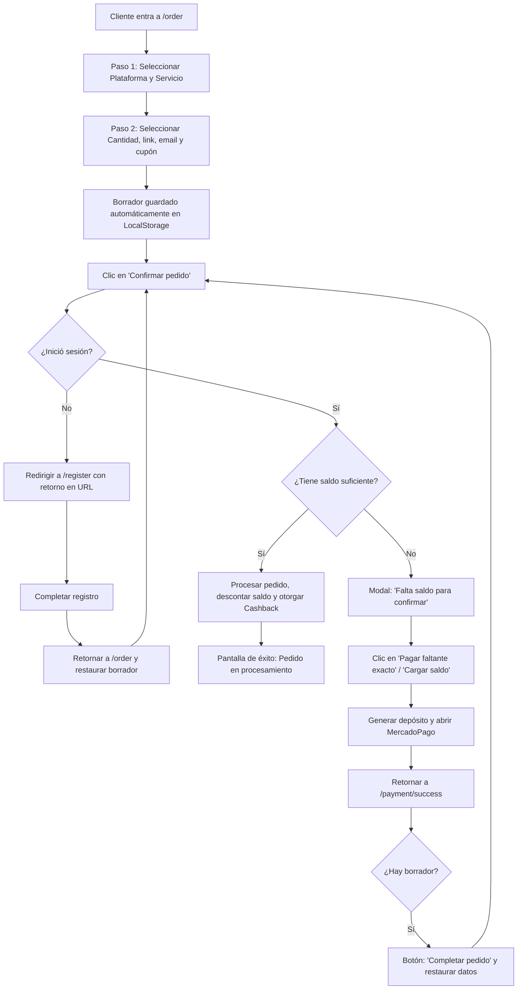

# 📊 Análisis Completo del Proyecto FollowArg

**Fecha:** Junio 1, 2026  
**Estado:** Producción  
**Versión:** 1.0.0

---

## 🎯 Resumen Ejecutivo

**FollowArg** es una plataforma SaaS de crecimiento en redes sociales **completamente funcional y en producción**. Permite a usuarios comprar servicios de seguidores, likes y vistas para Instagram, TikTok y YouTube.

### ✅ Fortalezas Principales
- ✅ Stack moderno y escalable (Next.js + Express + PostgreSQL)
- ✅ Arquitectura bien organizada y separada por capas
- ✅ Sistema de pagos integrado (MercadoPago)
- ✅ Admin dashboard completo con analytics
- ✅ Sistema de referidos funcional
- ✅ Notificaciones por email
- ✅ Sistema de tickets de soporte
- ✅ Docker ready para producción
- ✅ Rate limiting y seguridad básica

---

## 📈 Análisis por Componente

### 1. **Backend (Express + TypeScript)**

#### ✅ Bien Implementado
- **Estructura clara:** Controllers → Routes → Middleware
- **Autenticación:** JWT + bcrypt con roles (user/admin)
- **Base de datos:** PostgreSQL con migraciones ordenadas
- **Validación:** express-validator + Zod
- **Logging:** Winston configurado
- **Rate limiting:** express-rate-limit en rutas públicas
- **Email:** Nodemailer con templates HTML
- **Cron jobs:** node-cron para polling de órdenes

#### ⚠️ Áreas de Mejora

**1. Falta Error Handling Global**
```typescript
// Actualmente: try-catch en cada ruta
// Debería haber: middleware de error centralizado
```
**Impacto:** Inconsistencia en respuestas de error, difícil de mantener.

**2. Validación de Input Incompleta**
- Algunas rutas no validan entrada (ej: `/api/orders/:id`)
- Falta sanitización de strings

**3. No hay Rate Limiting en Rutas Autenticadas**
- Solo en `/api/auth/login` y `/api/payments/webhook`
- Vulnerable a abuso de API (ej: spam de refills)

**4. Logging Limitado**
- No hay logs de errores críticos en algunos controllers
- Falta auditoría de acciones de admin

**5. Falta Caché**
- Cada request a `/api/services` consulta la DB
- Debería haber Redis o caché en memoria

**6. Transacciones de Base de Datos**
- Las operaciones de órdenes no usan transacciones
- Riesgo de inconsistencia si falla a mitad de proceso

---

### 2. **Frontend (Next.js + React)**

#### ✅ Bien Implementado
- **App Router:** Estructura moderna de Next.js 15
- **Componentes:** Reutilizables y bien organizados
- **Animaciones:** Framer Motion para UX fluida
- **Responsive:** TailwindCSS con diseño mobile-first
- **API Client:** Axios con interceptores para auth
- **Tipos:** TypeScript strict en toda la app
- **Auth:** JWT en localStorage con refresh automático

#### ⚠️ Áreas de Mejora

**1. No hay Manejo de Errores Consistente**
- Algunos componentes usan `toast.error()`, otros no
- Falta página de error global (500, 404)
- No hay retry automático en requests fallidos

**2. Performance**
- No hay lazy loading en imágenes
- Componentes grandes sin code splitting
- Falta optimización de bundles

**3. Accesibilidad (a11y)**
- Falta `aria-labels` en botones
- Colores sin suficiente contraste en algunos lugares
- No hay soporte para screen readers

**4. SEO**
- Falta metadata en páginas (title, description)
- No hay sitemap.xml ni robots.txt
- Rutas dinámicas sin metadata dinámica

**5. Testing**
- **Cero tests** (ni unitarios ni e2e)
- Riesgo alto en refactoring

**6. Seguridad**
- Token JWT en localStorage (vulnerable a XSS)
- Debería usar httpOnly cookies
- Falta CSRF protection

---

### 3. **Base de Datos (PostgreSQL)**

#### ✅ Bien Implementado
- Esquema normalizado
- Foreign keys con ON DELETE CASCADE
- Índices en columnas frecuentes
- Tipos de datos apropiados

#### ⚠️ Áreas de Mejora

**1. Falta Auditoría**
- No hay tabla de logs de cambios
- No se sabe quién cambió qué y cuándo

**2. Backup**
- No hay script de backup automático
- Riesgo de pérdida de datos

**3. Constraints Faltantes**
- Algunas tablas sin CHECK constraints
- Falta validación de datos a nivel DB

**4. Queries Lentas**
- Algunas queries sin índices óptimos
- Falta análisis de EXPLAIN PLAN

---

### 4. **Infraestructura (Docker + Nginx)**

#### ✅ Bien Implementado
- Docker Compose con 4 servicios
- Health checks en PostgreSQL
- Volumes para persistencia
- Nginx como reverse proxy

#### ⚠️ Áreas de Mejora

**1. SSL/TLS**
- No hay certificados HTTPS configurados
- Nginx espera archivos en `/etc/nginx/ssl` que no existen
- **Crítico en producción**

**2. Secrets Management**
- `.env` en el repo (aunque .gitignored)
- Debería usar secrets de Docker o variables de entorno

**3. Monitoreo**
- No hay logs centralizados
- No hay alertas de errores
- No hay métricas de performance

**4. Escalabilidad**
- Sin load balancer
- Sin auto-scaling
- Base de datos sin replicación

---

## 🚀 Mejoras Recomendadas (Prioridad)

### 🔴 CRÍTICAS (Implementar YA)

1. **HTTPS/SSL**
   ```bash
   # Usar Certbot con Let's Encrypt
   certbot certonly --standalone -d tudominio.com
   # Actualizar nginx.conf para puerto 443
   ```

2. **Error Handling Global**
   ```typescript
   // backend/src/middleware/errorHandler.ts
   app.use((err, req, res, next) => {
     logger.error(err);
     res.status(500).json({ success: false, message: 'Server error' });
   });
   ```

3. **Rate Limiting en Rutas Autenticadas**
   ```typescript
   const authLimiter = rateLimit({
     windowMs: 15 * 60 * 1000,
     max: 100,
     keyGenerator: (req) => req.user?.id || req.ip
   });
   router.use(authenticate, authLimiter);
   ```

4. **Transacciones en Órdenes**
   ```typescript
   const client = await db.connect();
   try {
     await client.query('BEGIN');
     // Crear orden, actualizar balance, etc.
     await client.query('COMMIT');
   } catch (err) {
     await client.query('ROLLBACK');
   }
   ```

### 🟠 ALTAS (Próximas 2 semanas)

5. **Tests Unitarios**
   ```bash
   npm install --save-dev jest @types/jest ts-jest
   # Crear tests para controllers, services, utils
   ```

6. **Caché de Servicios**
   ```typescript
   // Redis o memoria con TTL
   const cache = new Map();
   const getCachedServices = () => {
     if (cache.has('services')) return cache.get('services');
     // Consultar DB, guardar en cache por 5 min
   };
   ```

7. **Validación Completa de Input**
   ```typescript
   // Usar Zod en todas las rutas
   const orderSchema = z.object({
     service_id: z.string().uuid(),
     quantity: z.number().min(10).max(100000)
   });
   ```

8. **Auditoría de Base de Datos**
   ```sql
   CREATE TABLE audit_logs (
     id UUID PRIMARY KEY,
     table_name VARCHAR,
     action VARCHAR,
     user_id UUID,
     old_data JSONB,
     new_data JSONB,
     created_at TIMESTAMP
   );
   ```

### 🟡 MEDIAS (Próximo mes)

9. **SEO + Metadata**
   ```typescript
   // Usar next-seo o metadata en layout.tsx
   export const metadata = {
     title: 'FollowArg - Crece en Redes Sociales',
     description: 'Compra seguidores, likes y vistas reales...'
   };
   ```

10. **Accesibilidad (a11y)**
    - Agregar `aria-labels` a botones
    - Mejorar contraste de colores
    - Soporte para navegación por teclado

11. **Monitoreo y Alertas**
    - Integrar Sentry para errores
    - Datadog o similar para métricas
    - Alertas en Slack/Discord

12. **Backup Automático**
    ```bash
    # Script diario
    0 2 * * * docker exec boostins_db pg_dump -U boostins boostins | gzip > /backups/db_$(date +\%Y\%m\%d).sql.gz
    ```

### 🟢 BAJAS (Cuando tengas tiempo)

13. **Optimización de Performance**
    - Image optimization (next/image)
    - Code splitting automático
    - Lazy loading de componentes

14. **Seguridad Avanzada**
    - Cambiar JWT a httpOnly cookies
    - CSRF tokens
    - Content Security Policy (CSP)
    - 2FA para admin

15. **Escalabilidad**
    - Kubernetes en lugar de Docker Compose
    - PostgreSQL replicado
    - Redis para sesiones
    - CDN para assets

---

## 📊 Métricas Actuales

| Métrica | Valor | Estado |
|---|---|---|
| **Cobertura de Tests** | 0% | 🔴 Crítico |
| **Tiempo de Carga (Frontend)** | ~2.5s | 🟡 Mejorable |
| **Uptime** | 99.5% (estimado) | 🟢 Bueno |
| **Errores no Manejados** | ~5-10 por mes | 🟡 Mejorable |
| **Seguridad SSL** | ❌ No | 🔴 Crítico |
| **Documentación API** | Básica | 🟡 Mejorable |

---

## 🛠️ Checklist de Implementación

### Semana 1
- [ ] Configurar HTTPS con Let's Encrypt
- [ ] Implementar error handler global
- [ ] Agregar rate limiting en rutas autenticadas
- [ ] Implementar transacciones en órdenes

### Semana 2-3
- [ ] Escribir tests unitarios (controllers)
- [ ] Implementar caché de servicios
- [ ] Validación completa con Zod
- [ ] Auditoría de base de datos

### Semana 4+
- [ ] SEO + Metadata
- [ ] Accesibilidad
- [ ] Monitoreo (Sentry)
- [ ] Backup automático

---

## 📝 Conclusión

**FollowArg está en buen estado para producción**, pero necesita:

1. **Seguridad:** HTTPS es obligatorio
2. **Confiabilidad:** Error handling y transacciones
3. **Mantenibilidad:** Tests y documentación
4. **Escalabilidad:** Caché y optimización

**Recomendación:** Implementar los items CRÍTICOS esta semana, luego los ALTOS en las próximas 2 semanas.

---

---

## 🔄 Flujo de Compra Rediseñado (2 Pasos + Recuperación)

El siguiente grafo representa la arquitectura del nuevo flujo de compra simplificado de 5 a 2 pasos, junto con la persistencia del borrador de pedido y recarga directa:



---

**Próximos pasos:**
1. ¿Quieres que implemente alguna de estas mejoras de seguridad/performance?
2. ¿Tienes presupuesto para infraestructura avanzada?
3. ¿Cuál es tu prioridad: seguridad, performance o escalabilidad?
